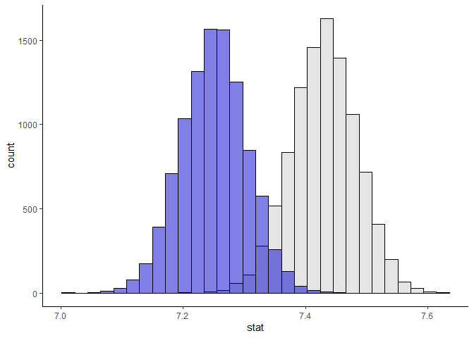

Lab 11 - Smoking during pregnancy
================
Ben Hardin
3/28/2023

### Load packages and data

``` r
library(tidyverse) 
library(tidymodels)
library(openintro)
```

``` r
set.seed(1234)
```

``` r
data(ncbirths)
```

### Exercise 1

There are 1000 cases (births) in our sample. For each birth, there are
13 variables.

1.  Father’s age (numerical)
2.  Mother’s age (numerical)
3.  Whether the mother was classified as “young” or “mature”
    (categorical)
4.  Length of pregnancy in weeks (numerical)
5.  Whether the birth was classified as premature or full-term
    (categorical)
6.  Number of hospital visits during pregnancy (numerical)
7.  Whether the mother was married or not married (categorical)
8.  Weight gained by the mother during pregnancy (numerical)
9.  Weight of the baby at birth (numerical)
10. Whether the baby was classified as low birthweight or not
    (categorical)
11. Gender of the baby (categorical)
12. Smoking status of the mother (categorical)
13. Whether the mother is white or not white (categorical)

There are a few outliers in our numerical data. In particular, there are
a lot of outliers for the babyweight variable, with a few babies with
very high birthweights and a lot of babies with very low birthweights.

``` r
tibble(ncbirths)
```

    ## # A tibble: 1,000 × 13
    ##     fage  mage mature   weeks premie visits marital gained weight lowbi…¹ gender
    ##    <int> <int> <fct>    <int> <fct>   <int> <fct>    <int>  <dbl> <fct>   <fct> 
    ##  1    NA    13 younger…    39 full …     10 not ma…     38   7.63 not low male  
    ##  2    NA    14 younger…    42 full …     15 not ma…     20   7.88 not low male  
    ##  3    19    15 younger…    37 full …     11 not ma…     38   6.63 not low female
    ##  4    21    15 younger…    41 full …      6 not ma…     34   8    not low male  
    ##  5    NA    15 younger…    39 full …      9 not ma…     27   6.38 not low female
    ##  6    NA    15 younger…    38 full …     19 not ma…     22   5.38 low     male  
    ##  7    18    15 younger…    37 full …     12 not ma…     76   8.44 not low male  
    ##  8    17    15 younger…    35 premie      5 not ma…     15   4.69 low     male  
    ##  9    NA    16 younger…    38 full …      9 not ma…     NA   8.81 not low male  
    ## 10    20    16 younger…    37 full …     13 not ma…     52   6.94 not low female
    ## # … with 990 more rows, 2 more variables: habit <fct>, whitemom <fct>, and
    ## #   abbreviated variable name ¹​lowbirthweight

``` r
ggplot(ncbirths, aes(y = fage))+
  geom_boxplot()
```

<!-- -->

``` r
ggplot(ncbirths, aes(y = mage))+
  geom_boxplot()
```

<!-- -->

``` r
ggplot(ncbirths, aes(y = weeks))+
  geom_boxplot()
```

<!-- -->

``` r
ggplot(ncbirths, aes(y = visits))+
  geom_boxplot()
```

<!-- -->

``` r
ggplot(ncbirths, aes(y = gained))+
  geom_boxplot()
```

<!-- -->

``` r
ggplot(ncbirths, aes(y = weight))+
  geom_boxplot()
```

<!-- -->

### Exercise 2

The average weight of (presumably) white babies is 7.25 pounds.

``` r
ncbirths_white <- ncbirths %>%
  filter(whitemom == "white")

mean(ncbirths_white$weight, na.rm = T)
```

    ## [1] 7.250462

### Exercise 3

We want to make an inference about what happens in the population, but
we only have a sample from the population, so this is a good situation
to use an inferential test.

### Exercise 4

First, i did one bootstrapped sample based on our sample of white NC
births, which ended up having a mean = 7.28.

``` r
birth_boot1 <- ncbirths_white %>%
  slice_sample(n = 1000, replace = T)

mean(birth_boot1$weight, na.rm = T)
```

    ## [1] 7.22885

Then, I ran 10,000 bootstrapped samples, and plotted the distribution of
these sample means against the distribution of sample means under the
null hypothesis.

Then, I computed a p-value for our observed mean weight under the null
hypothesis. The p-value for this test is p \< .001, indicating that
fewer than 0.1% of the bootstrapped sample means under the null
hypothesis were as extreme as the observed mean of our sample.

From this, we can conclude that the average weight of white babies born
in NC in 2004 is most likely truly lower than the average weight of
white babies born in the US in 1995. I also calculated a 95% confidence
interval for our samples, which tells us we can be 95% confident that
the average weight in the population of white babies born in NC is
somewhere between 7.14 to 7.36 pounds.

``` r
set.seed(1234)
birth_boot <- ncbirths_white %>%
  specify(response = weight) %>%
  generate(reps = 10000, type = "bootstrap") %>%
  calculate(stat = "mean")
```

``` r
mean(birth_boot$stat, na.rm = T)
```

    ## [1] 7.250139

``` r
birth_null <- birth_boot %>%
  mutate(stat = stat + 0.179903)

ggplot()+
  geom_histogram(data = birth_null, aes(x = stat), fill = "grey80", color = "black", alpha = 0.5)+
  geom_histogram(data = birth_boot, aes(x = stat), fill = "blue3", color = "black", alpha = 0.5)+
  theme_classic()
```

    ## `stat_bin()` using `bins = 30`. Pick better value with `binwidth`.
    ## `stat_bin()` using `bins = 30`. Pick better value with `binwidth`.

<!-- -->

``` r
observed_weight <- ncbirths_white %>%
  specify(response = weight) %>%
  calculate(stat = "mean")

get_p_value(birth_null, obs_stat = observed_weight, direction = "two-sided")
```

    ## # A tibble: 1 × 1
    ##   p_value
    ##     <dbl>
    ## 1  0.0008

``` r
birth_boot %>%
  summarize(lower = quantile(stat, 0.025),
            upper = quantile(stat, 0.975))
```

    ## # A tibble: 1 × 2
    ##   lower upper
    ##   <dbl> <dbl>
    ## 1  7.15  7.35

### Exercise 5

I made side-by-side boxplots showing baby’s weight as a function of
whether or not the mother is a smoker. What this shows is that children
of smokers and non-smokers showed similar median weights at birth, but
weights were generally somewhat lower for children of smoking mothers,
and there were more outliers for children of non-smoking mothers.

``` r
ncbirths %>%
  filter(!is.na(habit)) %>%
ggplot(aes(x = habit, y = weight))+
  geom_boxplot()
```

<!-- -->

### Exercise 6

I made a filtered dataset to only have those cases when mothers reported
if they were smokers.

``` r
ncbirths_habitgiven <- ncbirths %>%
  filter(!is.na(habit))
```

### Exercise 7

While there is descriptively a difference between the mean weight for
children of smoking vs. non-smoking mothers, we want to know if this is
a statistically significant difference (e.g., likely to be actually
different between the two populations). Thus, we are going to see if we
can reject the null hypothesis:

H0: M(smokers) = M(non-smokers)

and find evidence for the alternative hypothesis:

H1: M(smokers) =/= M(non-smokers)

``` r
ncbirths_habitgiven %>%
  group_by(habit) %>%
  summarise(mean_weight = mean(weight))
```

    ## # A tibble: 2 × 2
    ##   habit     mean_weight
    ##   <fct>           <dbl>
    ## 1 nonsmoker        7.14
    ## 2 smoker           6.83

### Exercise 8

Yes, because we want to infer from samples to a population.

### Exercise 9

I started running 10,000 bootstrapped samples for the distribution of
sample mean differences, for the difference between the mean birthweight
for the sample of children of non-smokers vs. the sample of children of
smokers. Then, I generated a distribution of sample mean differences
under the null hypothesis (i.e., the distribution of sample mean
differences if the true difference between these two populations = 0).
Then, I ran an inference test comparing the distribution under the null
to our observed mean difference of -.32. The p-value for this test was p
= .02, indicating that about 2% of the bootstrapped sample mean
differences under the null hypothesis were at least as extreme as the
observed mean difference in our sample.

From this, we can conclude that there is a good chance that these two
populations are indeed different. Under a NHST framework, we would
reject the null hypothesis.

``` r
set.seed(1234)
smoker_boot <- ncbirths_habitgiven %>%
  specify(weight ~ habit) %>%
  generate(reps = 10000, type = "bootstrap") %>%
  calculate(stat = "diff in means", order = c("smoker", "nonsmoker"))
```

``` r
mean(smoker_boot$stat, na.rm = T)
```

    ## [1] -0.3170139

``` r
smoker_null <- smoker_boot %>%
  mutate(stat = stat + 0.3170139)

ggplot()+
  geom_histogram(data = smoker_null, aes(x = stat), fill = "grey80", color = "black", alpha = 0.5)+
  geom_histogram(data =smoker_boot, aes(x = stat), fill = "grey30", color = "black", alpha = 0.5)+
  theme_classic()
```

    ## `stat_bin()` using `bins = 30`. Pick better value with `binwidth`.
    ## `stat_bin()` using `bins = 30`. Pick better value with `binwidth`.

<!-- -->

``` r
observed_diff <- ncbirths_habitgiven %>%
  specify(weight ~ habit) %>%
  calculate(stat = "diff in means", order = c("smoker", "nonsmoker"))

get_p_value(smoker_null, obs_stat = observed_diff, direction = "both")
```

    ## # A tibble: 1 × 1
    ##   p_value
    ##     <dbl>
    ## 1  0.0234

### Exercise 10

Now that we have some suggestion that there is a real difference in
birthweight between children of smokers vs. non-smokers, let’s get an
idea of what the actual difference might be. I calculated 95% confidence
intervals for the distribution of mean differences we generated earlier,
getting 95% CIs of \[-.58, -.06\]. This means we can be 95% certain that
the mean birthweight in the population of children of nonsmokers is
between about 1/2 a pound to .06 pounds lighter than the mean
birthweight in the population of children of smokers.

``` r
get_ci(smoker_boot, level = 0.95)
```

    ## # A tibble: 1 × 2
    ##   lower_ci upper_ci
    ##      <dbl>    <dbl>
    ## 1   -0.584  -0.0571

### Exercise 11

I determined the age cutoff for “maturity” in this dataset by 1)
plotting histograms of age for mature vs. young mothers, and 2) getting
a count for each age in both subsamples. Both of these show that the
cutoff for maturity is 35 years.

``` r
ggplot(ncbirths, aes(x = mage, fill = mature))+
geom_histogram(binwidth = 1)+
  theme_classic()
```

<!-- -->

``` r
ncbirths %>%
  group_by(mature) %>%
  count(mage)
```

    ## # A tibble: 33 × 3
    ## # Groups:   mature [2]
    ##    mature      mage     n
    ##    <fct>      <int> <int>
    ##  1 mature mom    35    35
    ##  2 mature mom    36    31
    ##  3 mature mom    37    26
    ##  4 mature mom    38    12
    ##  5 mature mom    39     7
    ##  6 mature mom    40     9
    ##  7 mature mom    41     8
    ##  8 mature mom    42     2
    ##  9 mature mom    45     1
    ## 10 mature mom    46     1
    ## # … with 23 more rows

### Exercise 12

``` r
set.seed(1234)
weight_age <- ncbirths %>%
  specify(response = lowbirthweight, explanatory = mature, success = "not low") %>%
  generate(reps = 1000, type = "bootstrap") %>%
  calculate(stat = "diff in props", order = c("younger mom", "mature mom"))
```

``` r
mean(weight_age$stat, na.rm = T)
```

    ## [1] 0.02679176

``` r
weight_age_null <- weight_age %>%
  mutate(stat = stat - (mean(weight_age$stat, na.rm = T)))

ggplot()+
  geom_histogram(data = weight_age_null, aes(x = stat), fill = "grey80", color = "black", alpha = 0.5)+
  geom_histogram(data = weight_age, aes(x = stat), fill = "grey30", color = "black", alpha = 0.5)+
  theme_classic()
```

    ## `stat_bin()` using `bins = 30`. Pick better value with `binwidth`.
    ## `stat_bin()` using `bins = 30`. Pick better value with `binwidth`.

<!-- -->

``` r
observed_prop <- ncbirths %>%
  specify(response = lowbirthweight, explanatory = mature, success = "not low") %>%
  calculate(stat = "diff in props", order = c("younger mom", "mature mom"))
            
get_p_value(weight_age_null, obs_stat = observed_prop, direction = "both")
```

    ## # A tibble: 1 × 1
    ##   p_value
    ##     <dbl>
    ## 1    0.37

### Exercise 13

``` r
get_ci(weight_age, level = 0.95)
```

    ## # A tibble: 1 × 2
    ##   lower_ci upper_ci
    ##      <dbl>    <dbl>
    ## 1  -0.0324   0.0925
